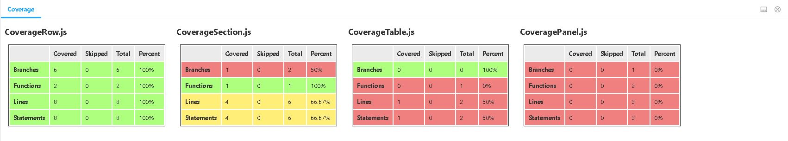

# Storybook Coverage Addon

****



This module provides an addon for Storybook which displays generated coverage reports inside an Addon tab.
Currently this module only supports jest coverage reports.

Simply run your test suite and generate a `jest-report.json` coverage file.

Then, in your storybook files, add the name of the files whose coverage you'd like to track to the 
parameters object of your stories like so:

```
Button.story = {
  parameters: {
    coverageFiles: ['Button.js'],
  },
};
```

When you run storybook, in the `Coverage` tab you should see a grid(s) displaying the code coverage
for the requested files.
